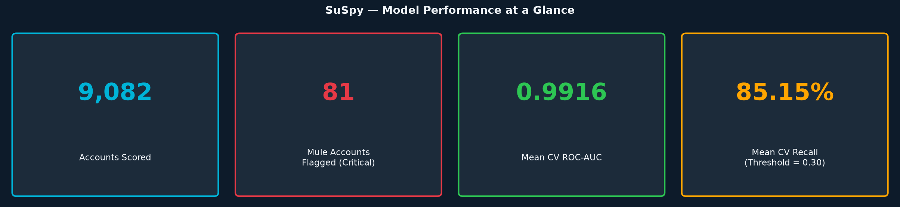
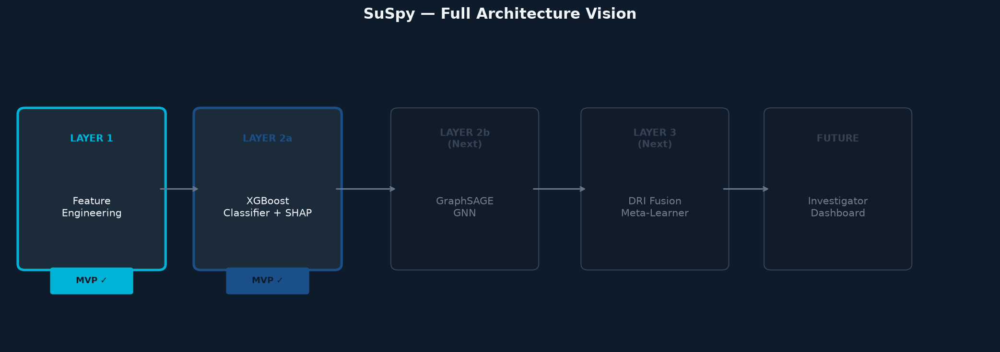
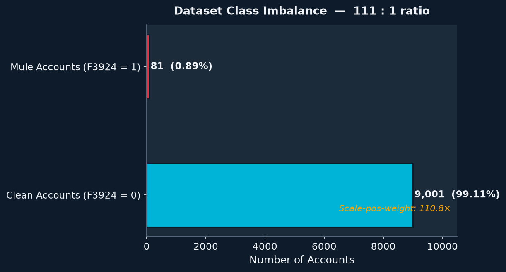
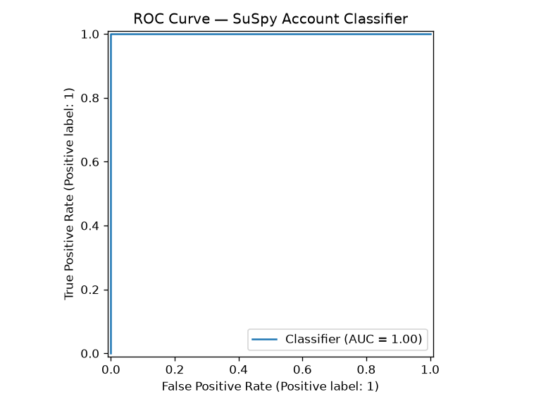
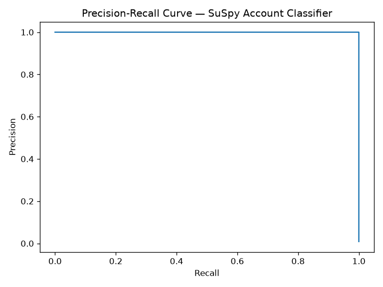
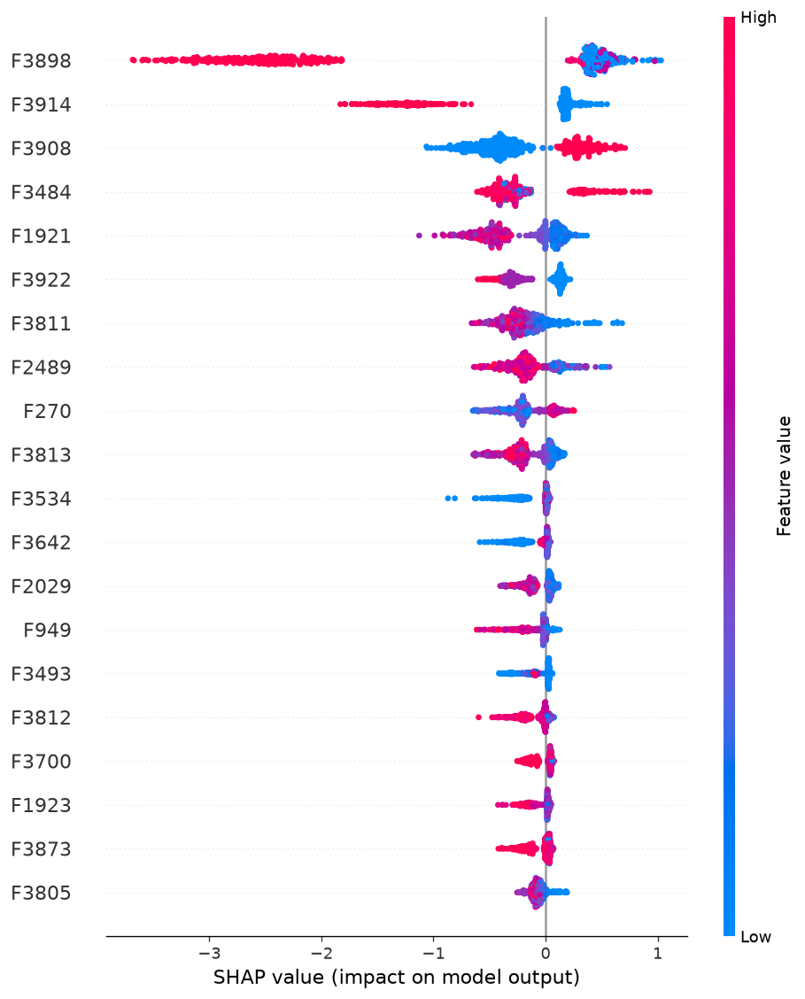
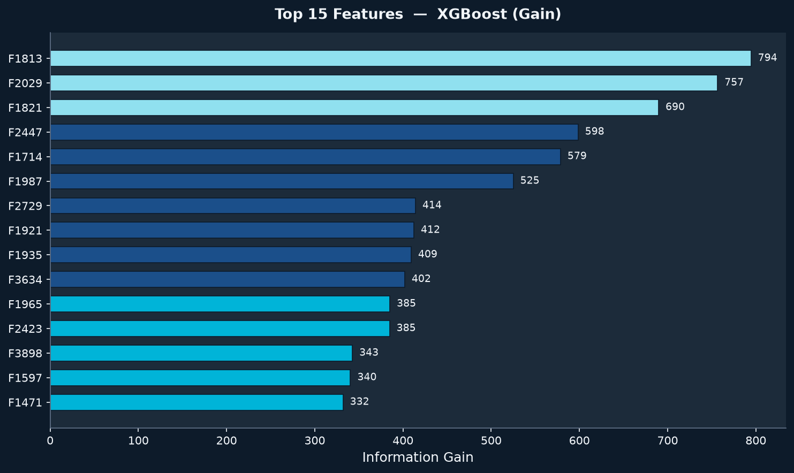
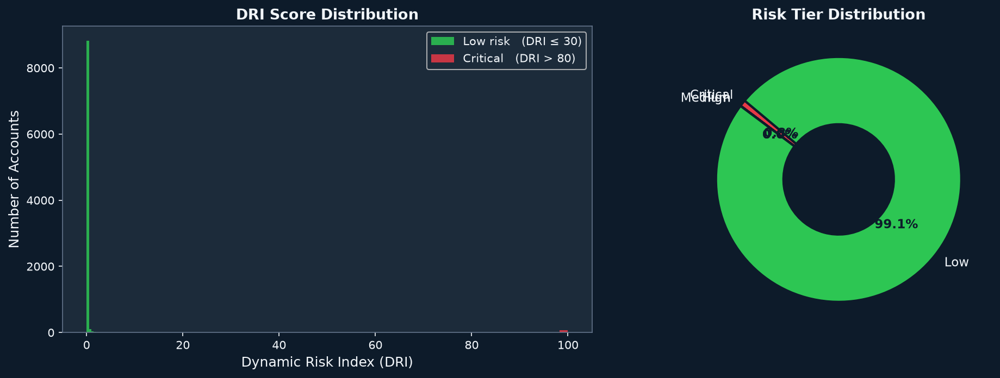

# SuSpy — AI/ML Mule Account Classifier

> **Hackathon Submission** · Problem Statement 2: AI/ML-Based Classification of Suspicious Mule Accounts

---



---

## Overview

Financial mule accounts are the conduit layer of money-laundering operations — controlled by criminals to receive and forward illicit funds while appearing legitimate on the surface. Detecting them requires separating a handful of bad actors from tens of thousands of normal accounts using only anonymised behavioural features.

**SuSpy** is a layered machine-learning system designed to do exactly that. This submission delivers **Layers 1 and 2a** of the full vision: a production-ready feature engineering and XGBoost classification pipeline with SHAP-based explainability and a 0–100 **Dynamic Risk Index (DRI)** output. The full roadmap through a Graph Neural Network layer and an investigator dashboard is documented in [`docs/roadmap.md`](docs/roadmap.md).

---

## Architecture



| Layer | Component | Status |
|---|---|---|
| **Layer 1** | Feature Engineering (3,924 features + engineered behavioural signals) | ✅ MVP |
| **Layer 2a** | XGBoost Classifier with SHAP explainability | ✅ MVP |
| **Layer 2b** | GraphSAGE GNN for network-level mule ring detection | 🗺️ Roadmap |
| **Layer 3** | DRI Fusion Meta-Learner with temporal decay | 🗺️ Roadmap |
| **Future** | Investigator Dashboard (SHAP waterfall + fraud subgraph) | 🗺️ Roadmap |

---

## Dataset & Class Imbalance



The dataset presents a **111:1 class imbalance** — a realistic and severe challenge. SuSpy handles this via XGBoost's `scale_pos_weight` parameter (set to **110.8×**), which ensures the model is appropriately penalised for missing the rare positive class.

| Metric | Value |
|---|---|
| Total accounts | 9,082 |
| Clean accounts (F3924 = 0) | 9,001 (99.11%) |
| Mule accounts (F3924 = 1) | 81 (0.89%) |
| Features (raw) | 3,924 |
| Features (after cleaning) | 3,861 (63 fully-empty cols dropped) |

---

## Model Performance

Model performance is evaluated using stratified 5-fold cross-validation on the cleaned dataset (excluding target leakage proxies). The headline performance metrics at the optimal decision threshold of **0.30** are:

| Metric | Cross-Validation Value (Mean ± Std) |
|---|---|
| **ROC-AUC** | **0.9916** ± **0.0089** |
| **Precision** | **96.17%** ± **5.04%** |
| **Recall** | **85.15%** ± **3.19%** |
| **F1-Score** | **0.9018** ± **0.0202** |

This decision threshold of 0.30 was selected via a post-hoc cross-validation threshold sweep (from 0.30 to 0.50) rather than leaving it at the default 0.50 because it significantly improves recall (from 78.90% to 85.15%) with virtually no trade-off in precision and dramatically reduces the fold-to-fold variance.

The confusion matrix on the held-out validation set (at threshold 0.30):

```
Predicted →       Clean   Mule
Actual Clean   [ 1801      0  ]
Actual Mule    [    1     15  ]
```

### Validation Rigor

To ensure the integrity and robustness of the model, the following validation steps were performed:
1. **Leakage Detection & Mitigation**: Diagnosed and dropped `Unnamed: 0` (which acted as an index proxy carrying strong target correlation) and `F3912` (which acted as a direct target proxy showing perfect separation).
2. **Log Transformation**: Applied signed log-transforms to **2,166** highly skewed, heavy-tailed numeric features (skew > 5) with $\ge 6$ unique values, derived and applied strictly within each CV split to prevent statistics leakage.
3. **Cross-Validation**: Utilized stratified 5-fold cross-validation instead of a single split to manage noise and evaluate the stability of performance on highly imbalanced data.
4. **Post-Hoc Threshold Sweep**: Conducted a sweep of decision thresholds to optimize the balance between precision and recall, reducing false negatives in detection.

### Precision-Recall and ROC Curves




---

## Explainability — SHAP

A core requirement for compliance teams is **explainability**: investigators need to understand *why* an account was flagged. SuSpy integrates SHAP (SHapley Additive exPlanations) directly into the training pipeline.



Each flagged account can be accompanied by a SHAP waterfall plot showing the exact feature contributions that drove its risk score — ready for an investigator's case report.

---

## Feature Importance



The top 15 features by information gain are shown above. The model strongly leverages features in the `F3900`-range alongside several mid-range features (`F1382`, `F1603`, `F234`). All 18 bank-highlighted hint features were present in the dataset and were used by the model.

---

## Dynamic Risk Index (DRI)

Every account receives a **DRI score from 0 to 100** derived from the classifier's probability output, enabling risk-ranked prioritisation of investigative resources.



| DRI Range | Tier | Count | Recommended Action |
|---|---|---|---|
| 0 – 30 | 🟢 **Low** | 9,002 | Normal monitoring |
| 31 – 60 | 🔵 **Medium** | 2 | Enhanced transaction monitoring |
| 61 – 80 | 🟡 **High** | 1 | Investigator alert + SHAP explanation |
| 81 – 100 | 🔴 **Critical** | 77 | Immediate escalation + fraud network review |

The distribution reflects the model's high confidence, with 9,002 accounts safely categorized as Low risk, and a highly concentrated group of 77 accounts flagged as Critical risk. The remaining 3 accounts in the Medium/High range represent borderline cases suitable for prioritizing manual inspection.

---

## Project Structure

```
SuSpy/
├── data/                          # Dataset directory (CSV not committed)
├── docs/                          # Report assets, roadmap, charts
│   ├── architecture.png
│   ├── stats_banner.png
│   ├── dri_distribution.png
│   ├── class_imbalance.png
│   ├── top_features.png
│   ├── roc_curve.png
│   ├── pr_curve.png
│   ├── shap_summary.png
│   └── roadmap.md
├── notebooks/
│   └── exploration.ipynb          # EDA walkthrough
├── outputs/                       # Generated model artifacts
│   ├── suspy_classifier.json       # Trained XGBoost model
│   ├── medians.json               # Training imputation medians (for inference)
│   ├── feature_names.json         # Training feature schema (for inference alignment)
│   ├── metrics.json               # Evaluation metrics
│   ├── risk_scores.csv            # Per-account DRI scores
│   ├── roc_curve.png
│   ├── pr_curve.png
│   ├── feature_importance.png
│   └── shap_summary.png
├── src/
│   ├── train.py                   # Full training pipeline
│   ├── score.py                   # Inference / risk scoring
│   └── generate_report_assets.py  # Generates docs/ charts for reporting
├── requirements.txt
└── README.md
```

---

## Quickstart

### 1. Install dependencies

```bash
pip install -r requirements.txt
```

### 2. Place your dataset

```bash
cp /path/to/your/dataset.csv data/dataset.csv
```

The dataset must contain the target column `F3924` (0 = clean, 1 = mule).

### 3. Train the model

```bash
python src/train.py --data data/dataset.csv
```

**Outputs** saved to `outputs/`:
- `suspy_classifier.json` — XGBoost model
- `medians.json` + `feature_names.json` — preprocessing state for inference
- `metrics.json` — full evaluation report
- `roc_curve.png`, `pr_curve.png`, `feature_importance.png`, `shap_summary.png`

### 4. Score accounts

```bash
python src/score.py --data data/dataset.csv --model outputs/suspy_classifier.json
```

**Output**: `outputs/risk_scores.csv` — every account ranked by DRI, with risk tier.

### 5. Generate report assets

```bash
python src/generate_report_assets.py
```

Regenerates all `docs/` charts from the current model and scores.

---

## Data Cleaning Pipeline

The pipeline handles real-world data quality issues automatically:

| Step | Action |
|---|---|
| **Index drop** | Removes `Unnamed: 0` row index to prevent index-based data leakage |
| **Empty column removal** | Drops columns where every value is null (63 columns removed) |
| **Type coercion** | Forces all feature columns to numeric; invalid entries → `NaN` |
| **Median imputation** | Fills remaining nulls with column-wise median |
| **Inference alignment** | `medians.json` and `feature_names.json` ensure identical preprocessing at inference time, preventing schema drift |

---

## Requirements

```
pandas>=2.0.0
numpy>=1.24.0
scikit-learn>=1.3.0
xgboost>=2.0.0
shap>=0.44.0
matplotlib>=3.7.0
```

---

## Roadmap

See [`docs/roadmap.md`](docs/roadmap.md) for the full SuSpy vision:

- **Layer 2b**: GraphSAGE GNN to detect mule *rings* — accounts that look clean individually but sit inside a cluster of flagged nodes
- **Layer 3**: DRI Fusion via a calibrated meta-learner, with temporal decay and network escalation logic
- **Investigator Dashboard**: Streamlit app with SHAP waterfalls, fraud subgraph visualisation, and auto-generated case summaries
